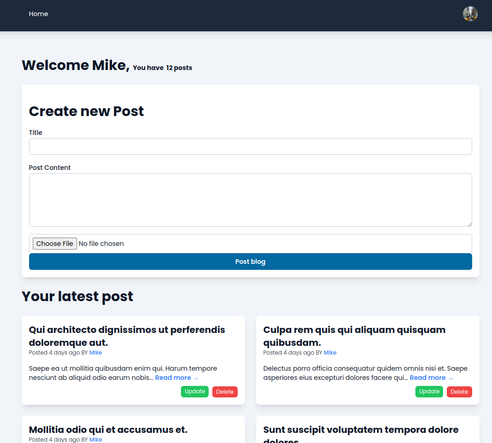
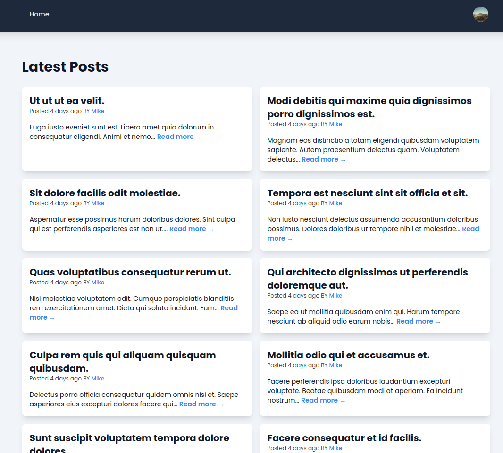

# Laravel 11 Blog App

This is a learning project where I built a basic blog application from scratch in Laravel 11, with no starter kits like Breeze or Jetstream. The main objective of this project is to dive deep into Laravel’s core functionality, better understand how things work under the hood, and implement features such as CRUD operations, authentication, and email verification without relying on pre-built starter kits.

## Features

-   Custom Starter Kit:
    Instead of using Laravel Breeze, I manually implemented the core functionality such as authentication and user management from scratch.

-   CRUD Operations for Blogs:
    CRUD blog posts with validation and database interactions.

-   Authentication:
    Manual implementation of user registration, login, logout, and password reset functionalities.

-   Email Verification:
    Added email verification upon user registration to ensure account validity.

-   User Roles & Permissions:
    Added basic role-based access control, allowing different types of users to manage content.

## Goals

Understand Laravel’s core concepts and how to build features without relying on a starter kit.
Gain hands-on experience with authentication, email verification, and CRUD operations.
Build a foundation that can be expanded upon with more advanced features or starter kits in future projects.
